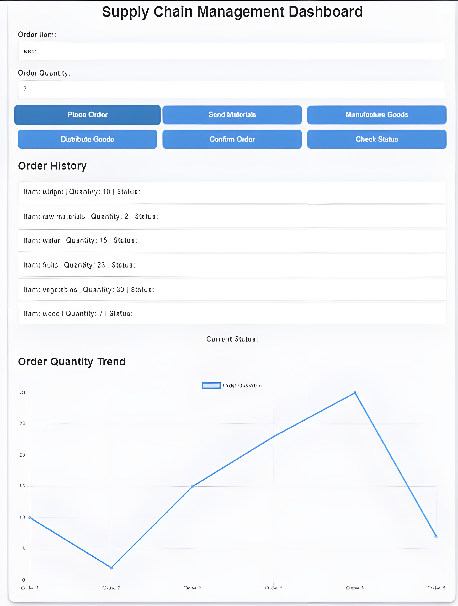
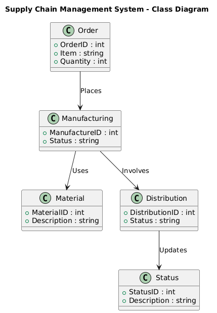
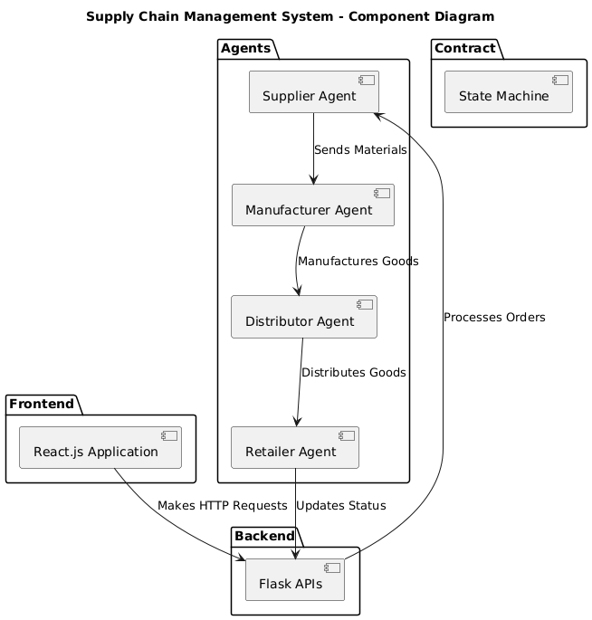
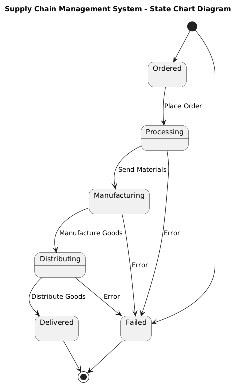
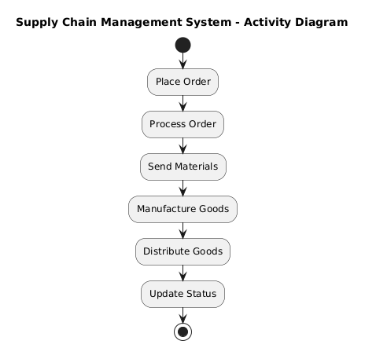

# Supply Chain Management System

## 🚀 Project Overview

The **Supply Chain Management System** is an advanced solution designed to optimize the flow of goods from suppliers to retailers. Leveraging a multi-agent architecture, this system facilitates seamless order processing, material handling, manufacturing, distribution, and order confirmation. The frontend offers a modern and interactive interface, while the backend ensures robust handling of business logic and agent communication.

**⚠️ Note:** The current implementation is a work in progress. Integration with DeltaV is pending, but a comprehensive overview of the project can be explored through the [Supply Chain Management Presentation](./fetch.ai_dApp.pdf) linked below.

## Live Demo

Check out the live demo: [dApp - Supply Chain Decentralization](https://fetchai-dapp.netlify.app/)

## 🌟 Features

- **Order Management:** Efficiently place orders, track status, and view order history.
- **Material Handling:** Manage the transfer of materials between agents seamlessly.
- **Manufacturing Control:** Oversee the manufacturing process from start to finish.
- **Distribution Management:** Ensure timely distribution of goods to retailers.
- **Order Confirmation:** Confirm and finalize orders with ease.
- **Responsive Design:** Optimized for various screen sizes, ensuring a consistent user experience.
- **Interactive Charts:** Visualize key metrics and statuses with dynamic charts.

## 🛠 Tech Stack

- **Frontend:**
  - **React.js** for building the user interface
  - **Axios** for HTTP requests
  - **Chart.js** for graphical data representation
  - **Tailwind CSS** for styling with a modern, responsive design

- **Backend:**
  - **Flask** for the RESTful API
  - **UAgenets** for the multi-agent system

- **Database:** Not implemented (suggest adding a database as needed)

- **Design:** Glassmorphism and responsive design principles

## 📂 Directory Structure

The project is organized as follows:

```
supply_chain_management/
├── backend/
│   ├── agents/
│   │   ├── supplier_agent.py
│   │   ├── manufacturer_agent.py
│   │   ├── distributor_agent.py
│   │   └── retailer_agent.py
│   ├── contracts/
│   │   └── state_machine_contract.py
│   └── app.py
├── frontend/
│   ├── public/
│   ├── src/
│   │   ├── App.js
│   │   └── index.js
│   └── package.json
└── README.md
```

## 📥 Installation

### Prerequisites

Ensure you have the following installed:
- **Node.js** and **npm** for managing JavaScript packages
- **Python 3.x** for running the backend
- **Flask** and other Python dependencies

### Setup Instructions

1. **Clone the Repository:**

   ```bash
   git clone https://github.com/Vvslaxman/supply-chain-management.git
   cd supply-chain-management
   ```

2. **Set Up the Frontend:**

   ```bash
   cd frontend
   npm install
   ```

3. **Set Up the Backend:**
##### will create requirements.txt very soon after completion after implementation ! < . . > !
#####                                                                                   ~ 
   ```bash
   cd ../backend
   pip install -r requirements.txt
   ```

4. **Run the Backend:**

   ```bash
   cd backend
   python app.py
   ```

5. **Run the Frontend:**

   ```bash
   cd ../fetch_frontend
   npm run dev
   ```

6. **Access the Application:**

   Open your browser and navigate to `http://localhost:5173` to view the frontend application.

## 🏗 Pending Integrations

- **DeltaV Integration:** Currently, the integration with DeltaV is not implemented. This feature will be included in future updates to enhance the system’s functionality.

## 📊 Diagrams

Explore the following diagrams to understand the system's architecture and design:

- **Implementation/Deployed Demo:**
 
  
- **Class Diagram:**
 
 
- **Component Diagram:**
 
 
- **State Diagram:**
 
 
- **Activity Diagram:**
 
 

## 📽 Presentation

For a detailed overview of the project's objectives, implementation, and future enhancements, please refer to the [Supply Chain Management Presentation](./fetch.ai_dApp.pdf).

## 🤝 Contributing

Contributions are welcome! Please open an issue or submit a pull request for any improvements or new features.

### Steps to Contribute:

1. **Fork the repository:**

   ```sh
   git clone https://github.com/yourusername/react-dashboard.git
   cd react-dashboard
   ```

2. **Create a new branch for your feature or bugfix:**

   ```sh
   git checkout -b feature-or-bugfix-name
   ```

3. **Make your changes and commit them:**

   ```sh
   git commit -am 'Add new feature or fix'
   ```

4. **Push your branch to GitHub:**

   ```sh
   git push origin feature-or-bugfix-name
   ```

5. **Create a Pull Request:**
   - Go to the repository on GitHub.
   - Click on the "New Pull Request" button.
   - Provide a description of your changes and submit the PR.

## 📝 Contact

For any questions or suggestions, please open an issue or contact [Vvslaxman](mailto:vvslaxman14@gmail.com).


